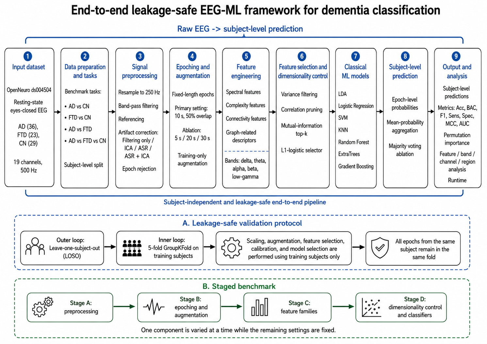
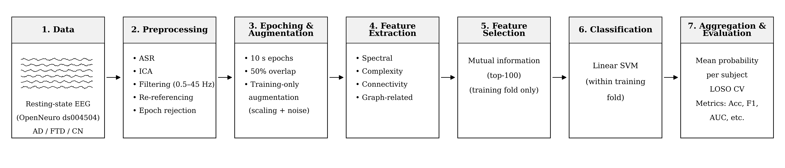
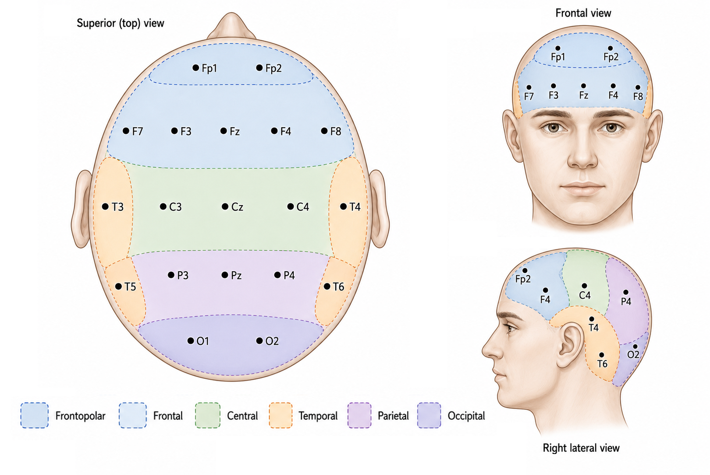
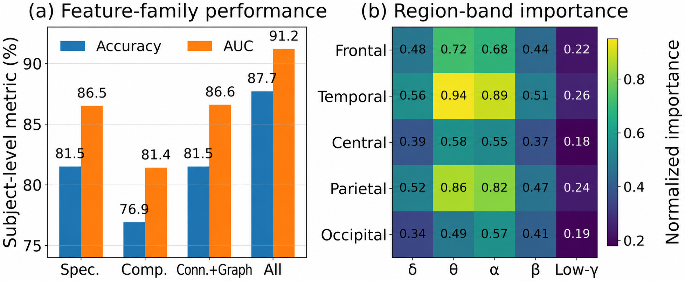

# Leakage-Safe EEG-ML Benchmark for Dementia Classification

Reference implementation of the end-to-end, **leakage-safe** classical
machine-learning pipeline described in the manuscript
*"Empirical Evaluation of EEG-Based Machine Learning Pipelines for Dementia
Classification"*.

The repository provides the complete engineering project that accompanies the
paper: every stage from raw resting-state EEG to subject-level prediction is
implemented as an inspectable, modular component. The code is organised so
that each block can be cross-checked against the corresponding section of the
manuscript (see [`METHODOLOGY.md`](METHODOLOGY.md) for a line-by-line map).

> **Note on scope.** This codebase is intended as a faithful, auditable
> reference for the paper's methodology and engineering pipeline. It documents
> and demonstrates every component end to end. Running it end to end requires
> the public OpenNeuro **ds004504** dataset (not redistributed here) and the
> optional EEG dependencies listed below.

---

## 1. Overview

Resting-state EEG is a low-cost, non-invasive signal source for dementia
screening, but EEG-based studies are hard to compare because they use
different preprocessing strategies, feature representations, classifiers, and
validation protocols. This project formalises an end-to-end framework and
instantiates it as a reproducible, leakage-safe classical ML pipeline that
benchmarks each design choice under the **same** subject-level validation
protocol.



The framework converts raw resting-state EEG from OpenNeuro ds004504 into
subject-level predictions through data preparation, signal preprocessing,
epoching and training-only augmentation, multi-domain feature engineering,
fold-internal feature selection, classical ML classification, and
subject-level analysis. The lower panels summarise the leakage-safe validation
protocol and the staged benchmark.

### Reference pipeline at a glance



| Stage | Selected setting |
| --- | --- |
| Resampling | 250 Hz |
| Band-pass filter | 0.5 – 45 Hz, zero-phase FIR (no notch) |
| Artifact correction | **ASR + ICA** (ICLabel-driven removal) |
| Epoching | 10 s, 50 % overlap |
| Training-only augmentation | amplitude scaling + Gaussian noise |
| Features | spectral + complexity + pairwise connectivity (**1596 raw**) |
| Feature selection | mutual information, **top-100** |
| Classifier | **linear SVM** with sigmoid calibration |
| Aggregation | **mean class probability** over epochs |
| Validation | leave-one-subject-out, inner 5-fold GroupKFold |

On **AD vs CN**, this configuration reaches **87.69 % accuracy**,
**88.89 % F1**, and **91.20 % AUC** under leakage-safe LOSO validation.

---

## 2. Dataset

The reference dataset is the public **OpenNeuro ds004504** resting-state,
eyes-closed EEG corpus, with three diagnostic groups recorded under a shared
acquisition protocol:

| Group | Subjects | Role in the benchmark |
| --- | --- | --- |
| AD (Alzheimer's disease) | 36 | disease-control & subtype classification |
| FTD (frontotemporal dementia) | 23 | differential dementia classification |
| CN (cognitively normal) | 29 | control group |
| **Total** | **88** | three-class benchmark |

Recordings use the international **10–20 montage** with 19 scalp channels.
For interpretation, channels are grouped into five anatomical regions.



The repository contains **code only** and does not redistribute the dataset.
Point `data.root` in [`configs/base.yaml`](configs/base.yaml) at a local copy
of a BIDS-style dataset that contains a `participants.tsv` file with a
diagnostic-group column.

---

## 3. Repository layout

```
.
├── README.md
├── LICENSE
├── METHODOLOGY.md              # section-by-section map between code and paper
├── pyproject.toml              # package metadata + tool config
├── requirements.txt            # pip dependencies
├── environment.yml             # conda environment
├── assets/                     # figures used in this README
├── configs/                    # OmegaConf configuration tree
│   ├── base.yaml               # experiment, data, evaluation defaults
│   ├── preprocessing.yaml      # Stage A variants (filter / ICA / ASR / ASR+ICA)
│   ├── features.yaml           # Stage B/C epoching, augmentation, feature families
│   ├── selection.yaml          # Stage D selection variants
│   └── classifiers.yaml        # Stage D classifier grids
├── src/eeg_benchml/
│   ├── constants.py            # channels, regions, bands, tasks, label aliases
│   ├── data/                   # BIDS discovery + label normalisation
│   ├── preprocessing/          # filtering, ICA, ASR, ASR+ICA orchestration
│   ├── epoching/               # fixed-length epochs, rejection, augmentation
│   ├── features/               # spectral / complexity / connectivity / graph
│   ├── selection/              # leakage-safe fold-internal selection
│   ├── models/                 # classifier registry + sigmoid calibration
│   ├── evaluation/             # LOSO, aggregation, metrics, uncertainty
│   ├── interpretation/         # permutation importance + region/band aggregation
│   ├── baselines/              # Table 4 fair-LOSO baseline recipes
│   ├── pipeline.py             # end-to-end orchestrator
│   └── utils/                  # logging, seeding, I/O, timing
├── scripts/                    # command-line entry points
│   ├── run_experiment.py       # single configuration
│   ├── run_staged_benchmark.py # Stage A–D ablation (Table 2)
│   ├── run_baselines.py        # Table 4 fair-LOSO baselines
│   ├── run_interpretation.py   # Fig. 4 region/band importance
│   └── describe_pipeline.py    # static description (no EEG data needed)
└── tests/                      # shape / aggregation / selection / interpretation
```

---

## 4. Methodology and code mapping

The pipeline is a **staged ablation**: a controlled base configuration is used
to vary one component at a time, and the best setting from each stage is
carried forward. The four stages and their modules are:

### Stage A — Signal preprocessing
`src/eeg_benchml/preprocessing/`

Resample to 250 Hz, zero-phase FIR band-pass (0.5–45 Hz), then one of four
artifact-correction variants:

* **filtering only** — band-pass + average reference.
* **ICA only** — ICLabel-driven component removal (probability > 0.80 for
  eye / muscle / heart / line-noise / channel-noise components).
* **ASR only** — Artifact Subspace Reconstruction (burst cutoff 20σ, flatline
  threshold 5 s, channel-correlation 0.80, max bad-window 0.25).
* **ASR + ICA** *(selected)* — ASR attenuates burst artifacts, then ICA
  removes residual ocular/muscular components.

Epoch rejection drops epochs with peak-to-peak amplitude > 150 µV or
log-variance > 3.5σ from the subject median.

### Stage B — Epoching and training-only augmentation
`src/eeg_benchml/epoching/`

Fixed-length 10 s epochs with 50 % overlap (Eq. 1). One augmented copy is
generated per **training** epoch via channel-wise amplitude scaling
`a_c ~ U(0.95, 1.05)` and Gaussian noise `ε_c ~ N(0, (0.01·σ_c)²)` (Eq. 2).
Validation and test subjects are never modified.

### Stage C — Multi-domain feature engineering
`src/eeg_benchml/features/`

With all families enabled, the raw feature vector has **1596** components:

| Family | Module | Dim. | Description |
| --- | --- | --- | --- |
| Spectral | `spectral.py` | 266 | 14/channel: band powers, relative powers, spectral entropy, alpha peak, rhythm ratios (Welch PSD, 4 s Hann, 50 % overlap, n_fft = 1024) |
| Complexity | `complexity.py` | 475 | 25/channel: Hjorth, sample entropy, Higuchi FD, MSE (scales 1–5), plus band-limited descriptors |
| Connectivity | `connectivity.py` | 855 | 171 channel pairs × 5 bands, weighted phase lag index (wPLI) |
| Graph | `graph.py` | 70 | 5 bands × (10 between-region wPLI means + 4 weighted graph descriptors) |

### Stage D — Feature selection and classifiers
`src/eeg_benchml/selection/`, `src/eeg_benchml/models/`

Fold-internal cascade: variance filter (1e-6) → Spearman correlation pruning
(0.95) → z-score standardisation → **mutual-information top-k** (k ∈ {50, 100,
200, 400}) or L1-logistic selection. Eight classifiers are benchmarked
(shrinkage LDA, logistic regression, linear / RBF SVM, KNN, random forest,
ExtraTrees, gradient boosting), each wrapped in sigmoid calibration so that the
same mean-probability aggregation applies uniformly.

**Every step is fitted on training subjects only — no statistic estimated from
test subjects is used for scaling, selection, calibration, or tuning.**

---

## 5. Results summary



**(a)** Subject-level accuracy and AUC for selected feature families on AD vs
CN. The combined spectral + complexity + connectivity set ("All") outperforms
any single family. **(b)** Normalised permutation importance by anatomical
region and frequency band, showing prominent temporal-parietal and
frontal-temporal contributions in the theta and alpha bands.

Final subject-level performance of the selected pipeline (leakage-safe LOSO):

| Task | Accuracy | F1 | AUC |
| --- | --- | --- | --- |
| AD vs CN | 87.69 % | 88.89 % | 91.20 % |
| FTD vs CN | 82.69 % | 80.00 % | 86.74 % |
| AD vs FTD | 77.97 % | 81.69 % | 82.31 % |
| AD vs FTD vs CN | 70.45 % | 69.73 % | 79.18 % |

---

## 6. Installation

```bash
# conda
conda env create -f environment.yml
conda activate eeg-benchml

# or pip
pip install -r requirements.txt
```

Core dependencies: NumPy, SciPy, pandas, scikit-learn, MNE-Python,
mne-icalabel, NetworkX, OmegaConf. ASR uses the optional `asrpy` package when
available and otherwise falls back to a deterministic NumPy implementation.

---

## 7. Usage

```bash
# Inspect the configured pipeline WITHOUT any EEG data (auditing tool)
python scripts/describe_pipeline.py

# Run the selected end-to-end pipeline on AD vs CN
python scripts/run_experiment.py experiment.task=ad_cn data.root=/path/to/ds004504

# Reproduce the staged benchmark (Table 2)
python scripts/run_staged_benchmark.py experiment.task=ad_cn data.root=/path/to/ds004504

# Reproduce the fair LOSO baselines (Table 4)
python scripts/run_baselines.py data.root=/path/to/ds004504

# Region / band permutation-importance interpretation (Fig. 4)
python scripts/run_interpretation.py experiment.task=ad_cn data.root=/path/to/ds004504
```

Configuration uses OmegaConf composition. Any value in the config tree can be
overridden on the command line, e.g. `experiment.seed=0`,
`features.epoch.duration_s=20`, or `--classifier rbf_svm`.

### Inspecting the pipeline without data

`scripts/describe_pipeline.py` prints a structured report of the dataset
definition, frequency bands, preprocessing parameters, feature dimensionality,
selection cascade, classifier grid, and evaluation protocol — all without
reading any EEG file. This is the quickest way to verify that the code matches
the manuscript.

---

## 8. Tests

```bash
pytest
```

The test suite verifies the constant tables, the exact feature
dimensionalities reported in Table 2 (266 / 475 / 855 / 70 / 1596), the
subject-level aggregation rules, the leakage-safe selection cascade, and the
interpretation aggregators. The tests use synthetic signals and do not require
the dataset.

---

## 9. License

Released under the MIT License — see [`LICENSE`](LICENSE).
